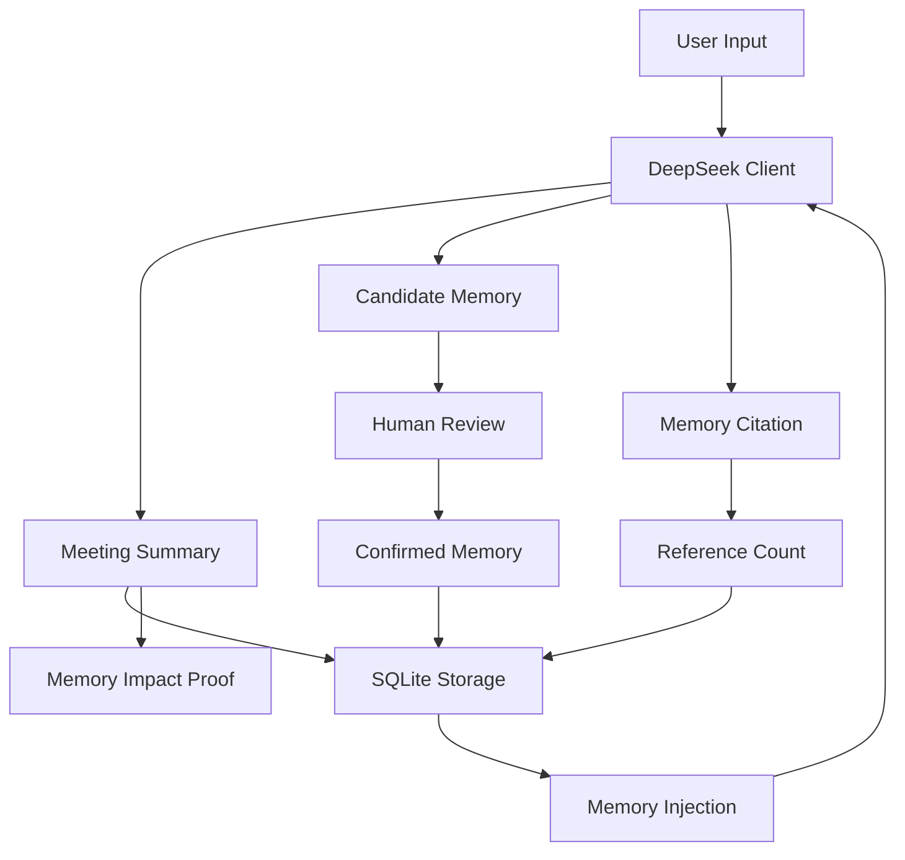
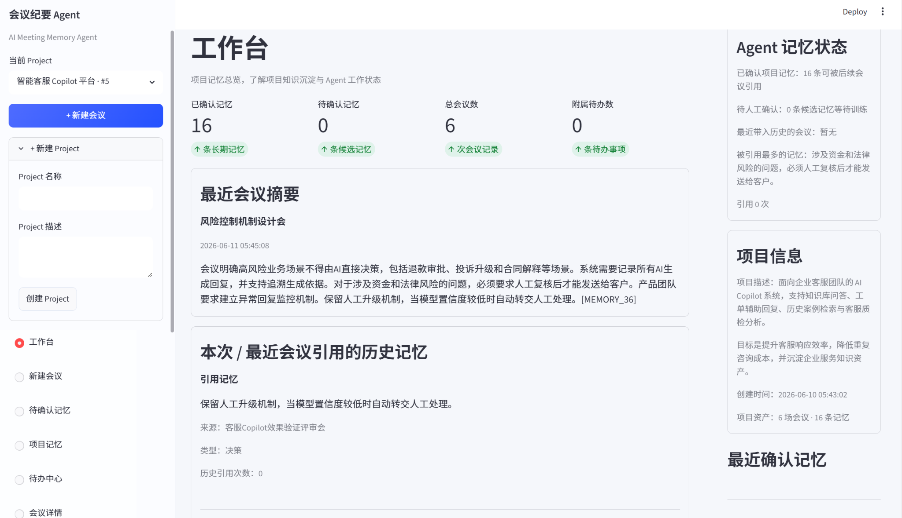
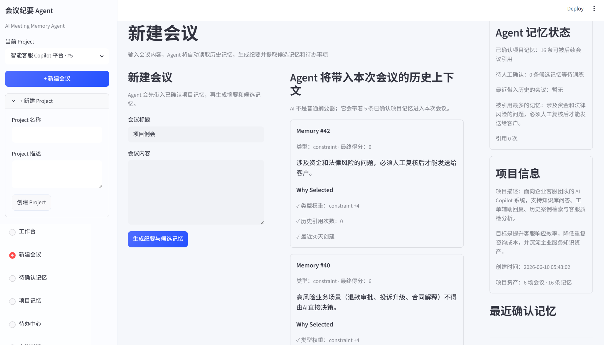
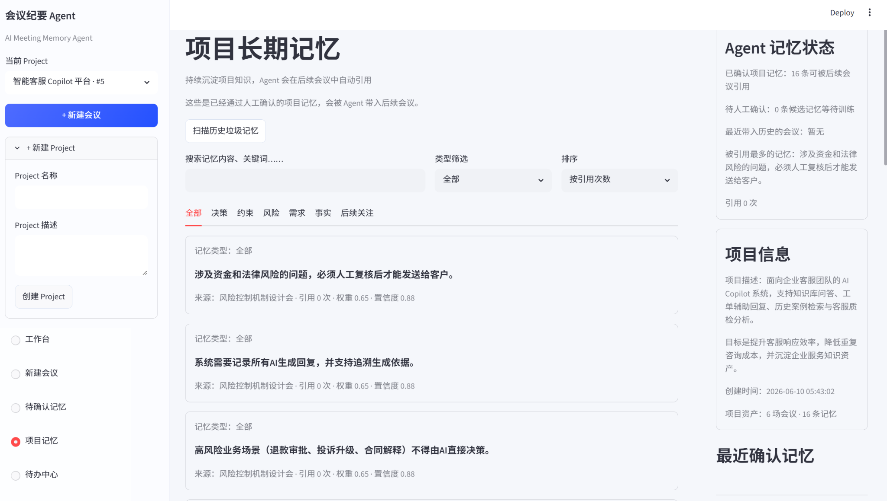
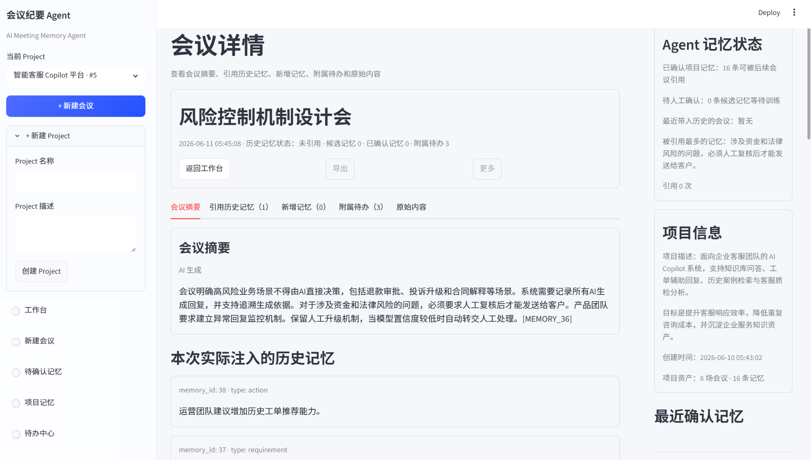
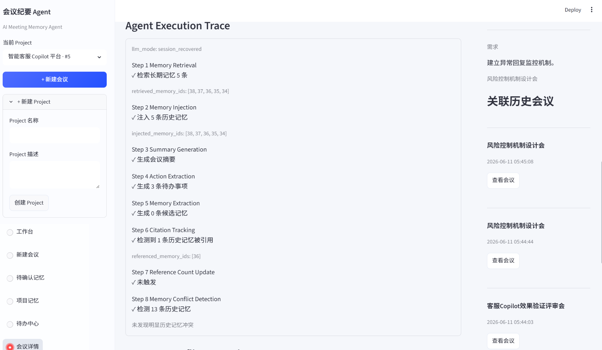
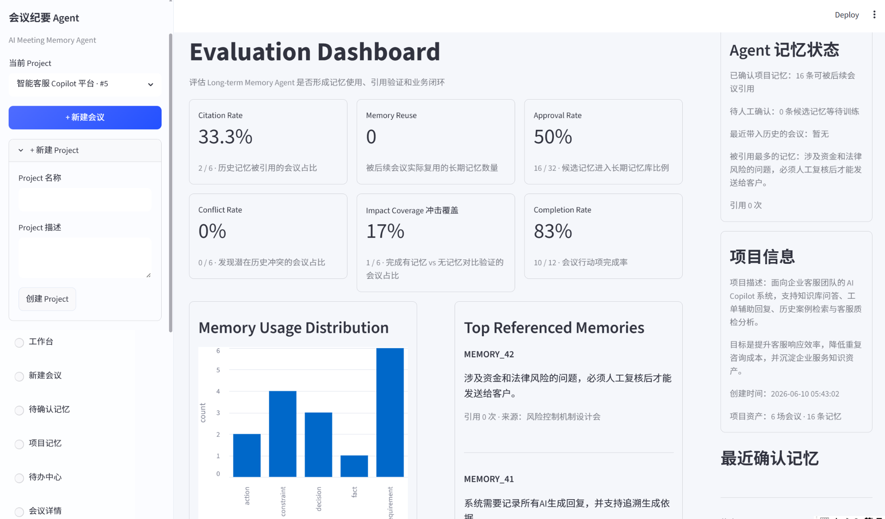
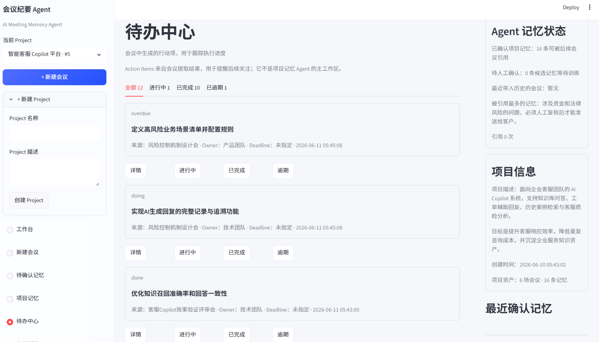

# Meeting Memory System

> An AI-powered Long-term Memory System for Project Collaboration

基于 DeepSeek、SQLite 与 Streamlit 构建的会议长期记忆系统，通过 Human-in-the-loop、Memory Citation 与 Memory Impact Proof，实现项目知识沉淀、跨会议引用与长期价值验证。


## 1. Project Overview（项目概览）

Meeting Memory System（会议长期记忆系统）是一个面向项目协作场景的会议知识系统，用 DeepSeek API、SQLite 和 Streamlit 实现会议摘要生成、长期记忆提取、人工审核、跨会议引用和效果验证。

它不是单次会议纪要工具，而是围绕“项目长期记忆”构建的 AI Agent MVP：系统会从会议中提炼候选记忆，经人工确认后进入长期记忆库，并在后续会议中被注入、引用和验证。

| 模块 | 说明 |
| --- | --- |
| 目标用户 | AI 产品经理、项目负责人、需要长期项目上下文的协作团队 |
| 核心问题 | 单次会议纪要无法沉淀长期决策、约束、风险和行动项 |
| 产品方案 | 将会议内容转化为可审核、可复用、可追溯、可评估的长期记忆 |
| Agent 能力 | 记忆召回、记忆注入、引用追踪、冲突检测、影响验证 |

## Highlights

- Human-in-the-loop 双层记忆审核机制
- Memory Citation 引用链路追踪
- Memory Impact Proof 记忆价值验证
- Reference Count 高频知识统计
- 长期记忆生命周期管理
- SQLite 本地知识存储

## 2. 项目背景与痛点

传统会议纪要工具通常只关注单次会议总结，能够回答“这次会议讲了什么”，但很难持续回答“这个项目过去做过什么决定、有哪些约束、哪些风险还没解决”。

在长期项目协作中，历史决策、需求变化、风险信号和待办事项很容易散落在多次会议记录里。随着会议数量增加，团队会反复讨论同类问题，或者遗忘之前已经确认过的上下文。这个项目尝试把会议内容转化为可沉淀、可审核、可引用、可验证的项目长期记忆。

## 3. 核心产品闭环

核心流程如下：

```text
会议输入
  -> DeepSeek 生成摘要与候选记忆
  -> Human-in-the-loop 审核
  -> Confirmed Memory 入库
  -> 后续会议注入历史记忆
  -> Memory Citation / Reference Count / Memory Impact Proof 验证记忆价值
```

这个闭环的重点不只是“生成内容”，而是让 AI 生成的知识经过人工确认、持续复用，并通过引用标记和对照生成证明其价值。

## 4. Architecture（系统架构）



系统采用轻量 MVP 架构：Streamlit 负责产品交互层，SQLite 保存会议、候选记忆、长期记忆和待办事项，DeepSeek Client 负责结构化生成。Agent 相关能力主要体现在记忆召回、Prompt 注入、Citation 解析、Reference Count 更新和 Memory Impact Proof 评估链路上。

## 5. Memory Retrieval Workflow（记忆召回流程）

当前版本没有接入向量数据库，而是采用规则版 Top-K Memory Retrieval，重点展示“Agent 为什么选择这些记忆”。系统会根据会议内容与长期记忆进行轻量评分，并在新建会议页展示 Why Selected。

```text
Meeting Content
  -> Keyword Match
  -> Memory Type Weight
  -> Reference Count
  -> Time Decay
  -> Top-K Selected Memories
  -> Prompt Injection
  -> Memory Citation
```

评分因素包括关键词命中、记忆类型权重、历史引用次数和时间衰减。这个设计的目标不是追求复杂算法，而是让召回过程可解释、可演示，并能回答“为什么这条历史记忆会被带入本次会议”。

## 6. 核心功能

### 6.1 Human-in-the-loop 审核流

系统区分 Candidate Memory 和 Confirmed Memory。DeepSeek 或 Mock fallback 只能生成候选记忆，不能直接写入长期记忆库。

用户可以对候选记忆进行确认、合并或拒绝。这个设计把大模型输出放在“待审核层”，降低幻觉、低价值信息和重复内容污染长期知识库的风险。

### 6.2 Memory Citation

系统在生成会议摘要时会注入已确认的历史记忆，并要求模型在使用某条历史记忆时，通过 `[MEMORY_ID]` 标记引用来源。

例如摘要中出现 `[MEMORY_8]`，就表示该句内容受 memory_id 为 8 的长期记忆影响。这个机制让模型输出不只是“看起来合理”，而是可以追溯到具体历史知识。

### 6.3 Memory Impact Proof

系统支持对照验证：同一份会议内容会形成“无历史记忆版本摘要”和“有历史记忆版本摘要”。

通过对比两种结果，系统可以展示历史记忆是否真正影响了模型输出，并统计引用历史记忆数量、新增关键词数量，以及是否出现 Memory Citation。这是对长期记忆模块价值的一种轻量验证。

### 6.4 Reference Count

当摘要中出现 `[MEMORY_ID]` 引用标记时，系统会解析被引用的 memory_id，并在当前会话中统计对应长期记忆的引用次数。

项目记忆页可以按引用次数排序，用于识别被频繁复用的高价值知识资产。引用次数较高的记忆会被标记为“核心资产”。

### 6.5 低价值记忆过滤与历史垃圾扫描

系统在候选记忆入库前会过滤低价值内容，例如“暂无历史记忆”“无内容”“待补充”“测试会议”“DS_PROBE”等无信息量或测试性质文本。

同时，项目记忆页提供历史垃圾记忆扫描能力，可以扫描已确认长期记忆中的疑似低价值内容，并允许用户人工删除，避免 Memory Layer 被持续污染。

### 6.6 待办事项追踪

系统可以从会议内容和候选记忆中提取行动项，并保存到待办中心。

待办事项支持状态管理，包括 open、doing、done 和 overdue，用于把会议中的后续行动从文本记录转化为可跟踪任务。

## 7. Evaluation Metrics（评估指标）

Evaluation Dashboard 用于从产品角度评估长期记忆系统是否真正被使用，而不是只看模型是否生成了摘要。

| 指标 | 含义 | 数据来源 |
| --- | --- | --- |
| Citation Rate | 有历史记忆引用的会议占比 | `meetings.summary` 中的 `[MEMORY_ID]` |
| Memory Reuse Count | 被后续会议复用过的长期记忆数量 | 长期记忆引用次数 |
| Candidate Approval Rate | 候选记忆进入长期记忆库的比例 | `memories` 与 `candidate_memories` |
| Conflict Detection Rate | 出现潜在历史冲突的会议占比 | Conflict Detection 规则结果 |
| Impact Proof Coverage | 完成有记忆 / 无记忆对照验证的会议占比 | Session State 中的 Impact Proof |
| Action Completion Rate | 会议行动项完成率 | `action_items.status` |

这些指标共同回答三个问题：长期记忆是否被召回，是否影响输出，以及是否形成了可持续治理闭环。

## 8. Tech Stack（技术栈）

- Python
- Streamlit
- SQLite
- DeepSeek API
- JSON Schema / Fallback / Session State

## 9. 项目亮点

- 不是单次会议总结，而是跨会议长期记忆系统
- 引入 Human-in-the-loop 控制大模型幻觉风险
- 用 Memory Citation 提高可解释性和可追溯性
- 用 Memory Impact Proof 验证记忆模块价值

## 10. Demo 截图

### 10.1 Dashboard

Dashboard 展示项目整体状态、长期记忆规模、候选记忆数量和最近会议情况。它用于快速判断当前项目知识沉淀是否健康，以及 Agent 最近是否发生了有效的记忆引用。



---

### 10.2 Long-term Memory Store

Long-term Memory Store 展示已确认长期记忆的存储、分类管理、搜索与治理能力。用户可以查看不同类型的项目记忆，并通过引用次数识别高价值知识资产。



---

### 10.3 Explainable Memory Retrieval

Explainable Memory Retrieval 展示 Agent 在会议开始前如何检索历史记忆，并给出每条记忆被选中的原因。页面会展示类型权重、历史引用次数、时间衰减等解释信息，让记忆注入过程可追踪。



---

### 10.4 Meeting Detail with Memory Citation

Meeting Detail with Memory Citation 展示历史记忆如何被注入当前会议，并通过 `[MEMORY_ID]` 影响最终摘要。该页面用于证明系统不是简单总结会议，而是在复用长期项目知识。



---

### 10.5 Agent Execution Trace

Agent Execution Trace 展示完整工作流：Memory Retrieval → Memory Injection → Summary Generation → Action Extraction → Citation Tracking → Conflict Detection。它让用户和面试官能够看到 Agent 在一次会议生成过程中具体做了哪些决策和动作。



---

### 10.6 Action Item Tracking

Action Item Tracking 展示系统如何从会议中自动抽取待办事项，并在待办中心进行状态管理。它补充了会议长期记忆之外的执行跟踪能力。



---

### 10.7 Evaluation Dashboard

Evaluation Dashboard 展示长期记忆系统的引用率、候选记忆通过率、冲突检测率和影响验证覆盖率。它用于从产品评估角度证明长期记忆是否被使用、是否形成闭环，以及是否产生业务价值。



## 11. Demo Scenario

项目名称：AI会议知识助手

演示数据：

- 5 场会议
- 15 条长期记忆
- 11 条待办事项

已验证能力：

- 长期记忆沉淀
- 跨会议知识引用
- Memory Citation
- Human-in-the-loop
- Reference Count
- Memory Conflict Detection
- Evaluation Dashboard
- 生命周期管理

## 12. Quick Start（如何运行）

```bash
pip install -r requirements.txt
python scripts/init_db.py
python -m streamlit run app.py
```

首次启动会初始化本地 SQLite 数据库文件 `data/meeting_memory.db`。

如需使用 DeepSeek 真实生成链路，请在项目根目录创建 `.env` 并配置：

```bash
DEEPSEEK_API_KEY=your_api_key_here
```

未配置 API Key 或 DeepSeek 调用失败时，系统会自动回退到 Mock fallback，保证 MVP 可以继续运行。

## 13. 当前边界与 Roadmap

当前边界：

- 当前为 MVP 原型
- 当前主要使用 SQLite 和 Streamlit
- 当前未接入向量数据库，现阶段使用规则版 Top-K Memory Retrieval
- 当前无多人协作与权限系统

后续规划：

- 向量检索 / Top-K Semantic Memory Retrieval
- 冲突检测规则优化与人工处理闭环
- 主动召回提醒
- 更完整的离线评估指标体系

## Product Thinking

传统会议纪要工具解决的是“记录问题”。

Meeting Memory System 试图解决的是“知识遗忘问题”。

随着项目周期拉长，决策、约束、需求、风险和行动项会散落在多次会议中。团队成员往往需要反复检索历史记录，甚至重复讨论已经达成共识的问题。

因此，本项目尝试将会议内容沉淀为长期记忆资产，并通过 Human-in-the-loop、Memory Citation 与 Memory Impact Proof 构建“生成—审核—沉淀—引用—验证”的知识闭环。

目标不是生成一次会议纪要，而是帮助团队持续积累和复用项目知识。
